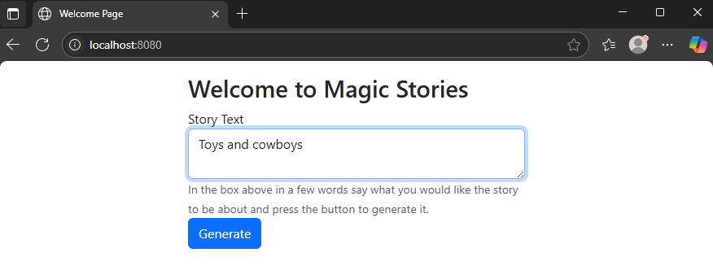

# Magic Stories

## Description

Magic Stories is a web application that allows users to generate child-friendly stories based on their input. It leverages the power of the OpenAI ChatGPT API to create unique and engaging narratives. The application is built using Java and the Spring Boot framework.

A project used to explore the OpenAI API and provide some interesting bed time reading for my kids.

## Features

*   **Story Generation:** Users can input a prompt or a few keywords, and the application will generate a story using the ChatGPT API.
*   **User Management:** Includes basic login functionality.
*   **Web Interface:** Provides a simple and intuitive web interface for interacting with the application, built with Thymeleaf and Bootstrap.

## Future Work

Here are some potential features and improvements planned for future versions of Magic Stories:

*   **Dockerization:** Package the application into a Docker container for easier deployment and hosting on servers.
*   **Expand Service Offerings:** Integrate additional services beyond story generation, such as a "Cooking Recipes" generator or other creative content.
*   **Multiple LLM Providers:** Add support for other Large Language Models (LLMs) in addition to ChatGPT, offering users more choices.
*   **UI Configuration for API Keys:** Implement a menu section in the user interface to allow users to configure API keys directly, rather than needing to modify property files.

## Technologies Used

*   **Java 17**
*   **Spring Boot:**
    *   Spring Web
    *   Spring Data JPA
    *   Spring Security
    *   Thymeleaf
*   **OpenAI ChatGPT API:** For generating stories.
*   **H2 Database:** In-memory database for development/testing.
*   **Gradle:** Build automation tool.
*   **HTML, Bootstrap:** For the front-end.

## Configuration

To run this project, you will need to configure the OpenAI API credentials. These are specified in the application properties (e.g., `application.properties` or `application.yml`):

*   `chatgpt.key`: Your OpenAI API key.
*   `chatgpt.organizationid`: Your OpenAI Organization ID.
*   `chatgpt.url`: The OpenAI API endpoint URL (e.g., `https://api.openai.com/v1/chat/completions`).

Make sure to replace the placeholder values with your actual credentials.

## How to Use

1.  **Build the project:**
    ```bash
    ./gradlew build
    ```
2.  **Run the application:**
    ```bash
    java -jar build/libs/magicstories-0.0.1-SNAPSHOT.jar
    ```
    (Or run it directly from your IDE).
3.  Open your web browser and navigate to `http://localhost:8080/`.
4.  You will be presented with a welcome page where you can input your story idea.
5.  Enter a few words describing the story you want (e.g., "a brave knight and a friendly dragon").
6.  Click the "Generate" button.
7.  The application will then display the generated story title and text.


## Project Structure

The main logic for handling requests and interacting with the ChatGPT API can be found in `com.bytemaximus.magicstories.MainController.java`.
HTML templates are located in the `src/main/resources/templates` directory (e.g., `index.html`, `story.html`).

## License

This project is licensed under the MIT License - see the [LICENSE.md](docs/LICENSE.md) file for details.
